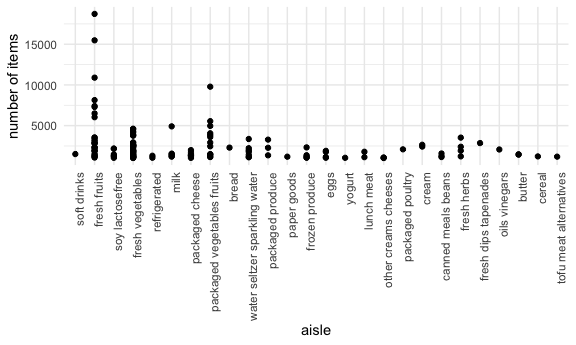
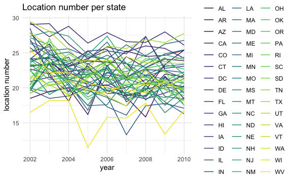
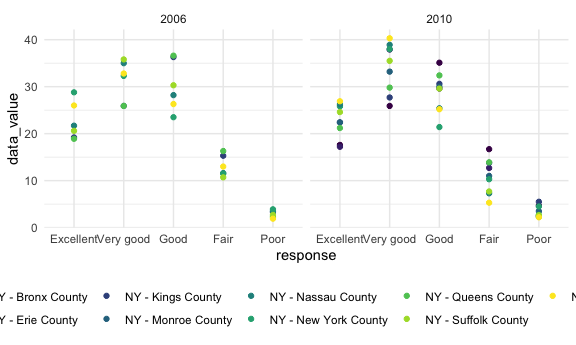
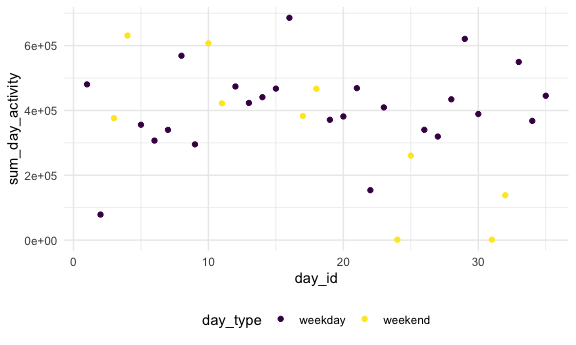
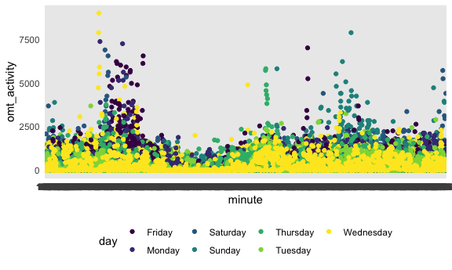

hw3
================
IRENE MARTINEZ MORATA (UNI: im2557)
10/14/2021

## Problem 1

How many aisles are there, and which aisles are the most items ordered
from? There are 134 aisles, most items are ordered from fresh
vegetables, fresh fruits and packaged vegetables and fruits items.

``` r
data("instacart")
instacart %>%
  group_by(aisle) %>%
summarize(n = n()) %>%
arrange(desc(n))
```

    ## # A tibble: 134 × 2
    ##    aisle                              n
    ##    <chr>                          <int>
    ##  1 fresh vegetables              150609
    ##  2 fresh fruits                  150473
    ##  3 packaged vegetables fruits     78493
    ##  4 yogurt                         55240
    ##  5 packaged cheese                41699
    ##  6 water seltzer sparkling water  36617
    ##  7 milk                           32644
    ##  8 chips pretzels                 31269
    ##  9 soy lactosefree                26240
    ## 10 bread                          23635
    ## # … with 124 more rows

Make a plot that shows the number of items ordered in each aisle,
limiting this to aisles with more than 10000 items ordered. Arrange
aisles sensibly, and organize your plot so others can read it.

``` r
plot1 <- instacart %>% 
  group_by(product_id, aisle) %>% 
  summarize(n = n()) %>%
  mutate(product_n = n >= 1000) %>% 
  filter(product_n == TRUE) %>%
  mutate(aisle = reorder(aisle, desc(n))) %>%
   ggplot(
       aes(x = aisle, y = n)) +
  geom_point() +
  labs(
    x = "aisle",
    y = "number of items"
  )  +
  theme(axis.text.x = element_text(angle = 90, hjust = 1))
```

    ## `summarise()` has grouped output by 'product_id'. You can override using the `.groups` argument.

``` r
print(plot1)
```



Make a table showing the three most popular items in each of the aisles
“baking ingredients”, “dog food care”, and “packaged vegetables fruits”.
Include the number of times each item is ordered in your table.

``` r
instacart %>% 
  group_by(aisle, product_name) %>% 
  summarize(n = n()) %>% 
  filter(aisle == "baking ingredients" | aisle == "dog food care" | aisle == "packaged vegetables fruits") %>% 
  mutate(n_ranking = min_rank(desc(n))) %>% 
  filter(n_ranking < 4) %>% 
   knitr::kable()
```

    ## `summarise()` has grouped output by 'aisle'. You can override using the `.groups` argument.

| aisle                      | product\_name                                 |    n | n\_ranking |
|:---------------------------|:----------------------------------------------|-----:|-----------:|
| baking ingredients         | Cane Sugar                                    |  336 |          3 |
| baking ingredients         | Light Brown Sugar                             |  499 |          1 |
| baking ingredients         | Pure Baking Soda                              |  387 |          2 |
| dog food care              | Organix Chicken & Brown Rice Recipe           |   28 |          2 |
| dog food care              | Small Dog Biscuits                            |   26 |          3 |
| dog food care              | Snack Sticks Chicken & Rice Recipe Dog Treats |   30 |          1 |
| packaged vegetables fruits | Organic Baby Spinach                          | 9784 |          1 |
| packaged vegetables fruits | Organic Blueberries                           | 4966 |          3 |
| packaged vegetables fruits | Organic Raspberries                           | 5546 |          2 |

Make a table showing the mean hour of the day at which Pink Lady Apples
and Coffee Ice Cream are ordered on each day of the week; format this
table for human readers (i.e. produce a 2 x 7 table).

``` r
instacart %>%
  filter(product_name == "Pink Lady Apples" | product_name == "Coffee Ice Cream") %>% 
  mutate(order_day = ordered(order_dow, labels = c("Monday", "Tuesday", "Wednesday", "Thursday", "Friday", "Saturday", "Sunday"))) %>% 
  group_by(product_name, order_day) %>% 
  summarize(mhour = mean(order_hour_of_day)) %>% 
  spread(key = order_day, value = mhour) %>% 
  knitr::kable()
```

    ## `summarise()` has grouped output by 'product_name'. You can override using the `.groups` argument.

| product\_name    |   Monday |  Tuesday | Wednesday | Thursday |   Friday | Saturday |   Sunday |
|:-----------------|---------:|---------:|----------:|---------:|---------:|---------:|---------:|
| Coffee Ice Cream | 13.77419 | 14.31579 |  15.38095 | 15.31818 | 15.21739 | 12.26316 | 13.83333 |
| Pink Lady Apples | 13.44118 | 11.36000 |  11.70213 | 14.25000 | 11.55172 | 12.78431 | 11.93750 |

## Problem 2

First, do some data cleaning:

format the data to use appropriate variable names; focus on the “Overall
Health” topic include only responses from “Excellent” to “Poor” organize
responses as a factor taking levels ordered from “Poor” to “Excellent”

``` r
brfs <- p8105.datasets::brfss_smart2010 %>%
  janitor::clean_names() %>%
  rename(state = locationabbr, county = locationdesc) %>%
  filter(topic == "Overall Health" & (response == "Excellent" | response == "Very good" |  response == "Good" | response == "Fair" | response == "Poor")) %>% 
  mutate(response = as_factor(response), levels(c("Poor","Fair", "Good", "Very Good", "Excellent")))
```

In 2002, which states were observed at 7 or more locations? in 2002, 36
states were observed at 7 or more locations including AZ, CO, CT, DE,
FL, GA…among others (see table) What about in 2010? In 2010, 45 states
were observed at 7 or more locations, including AL, AR, AZ, CA, HI…
among others(see table)

``` r
brfs %>% 
  filter(year == 2002) %>% 
  group_by(state) %>% 
  summarize(n_sites = n()) %>% 
  filter(n_sites >= 7) %>% 
  knitr::kable()
```

| state | n\_sites |
|:------|---------:|
| AZ    |       10 |
| CO    |       20 |
| CT    |       35 |
| DE    |       15 |
| FL    |       35 |
| GA    |       15 |
| HI    |       20 |
| ID    |       10 |
| IL    |       15 |
| IN    |       10 |
| KS    |       15 |
| LA    |       15 |
| MA    |       40 |
| MD    |       30 |
| ME    |       10 |
| MI    |       20 |
| MN    |       20 |
| MO    |       10 |
| NC    |       35 |
| NE    |       15 |
| NH    |       25 |
| NJ    |       40 |
| NV    |       10 |
| NY    |       25 |
| OH    |       20 |
| OK    |       15 |
| OR    |       15 |
| PA    |       50 |
| RI    |       20 |
| SC    |       15 |
| SD    |       10 |
| TN    |       10 |
| TX    |       10 |
| UT    |       25 |
| VT    |       15 |
| WA    |       20 |

``` r
brfs %>% 
  filter(year == 2010) %>% 
  group_by(state) %>% 
  summarize(n_sites = n()) %>% 
  filter(n_sites >= 7) %>% 
  knitr::kable ()
```

| state | n\_sites |
|:------|---------:|
| AL    |       15 |
| AR    |       15 |
| AZ    |       15 |
| CA    |       60 |
| CO    |       35 |
| CT    |       25 |
| DE    |       15 |
| FL    |      205 |
| GA    |       20 |
| HI    |       20 |
| IA    |       10 |
| ID    |       30 |
| IL    |       10 |
| IN    |       15 |
| KS    |       20 |
| LA    |       25 |
| MA    |       45 |
| MD    |       60 |
| ME    |       30 |
| MI    |       20 |
| MN    |       25 |
| MO    |       15 |
| MS    |       10 |
| MT    |       15 |
| NC    |       60 |
| ND    |       15 |
| NE    |       50 |
| NH    |       25 |
| NJ    |       95 |
| NM    |       30 |
| NV    |       10 |
| NY    |       45 |
| OH    |       40 |
| OK    |       15 |
| OR    |       20 |
| PA    |       35 |
| RI    |       25 |
| SC    |       35 |
| SD    |       10 |
| TN    |       25 |
| TX    |       80 |
| UT    |       30 |
| VT    |       30 |
| WA    |       50 |
| WY    |       10 |

Construct a dataset that is limited to Excellent responses, and
contains, year, state, and a variable that averages the data\_value
across locations within a state. Make a “spaghetti” plot of this average
value over time within a state (that is, make a plot showing a line for
each state across years – the geom\_line geometry and group aesthetic
will help).

``` r
bfrsplot <- brfs %>% 
  filter(response == "Excellent") %>% 
  group_by(state, year) %>% 
  summarize(average_state = mean(data_value)) %>% 
ggplot(aes(x = year, y = average_state, color = state)) +
  geom_line() +
  labs(
    title = "Location number per state",
    x = "year",
    y = "location number"
  ) +
  theme(legend.position = "right")
```

    ## `summarise()` has grouped output by 'state'. You can override using the `.groups` argument.

``` r
print(bfrsplot)
```

    ## Warning: Removed 3 row(s) containing missing values (geom_path).



Make a two-panel plot showing, for the years 2006, and 2010,
distribution of data\_value for responses (“Poor” to “Excellent”) among
locations in NY State.

``` r
brfsplot2 <- brfs %>% 
  filter(
    year == 2006 | year == 2010) %>% 
  filter( state == "NY") %>% 
  ggplot(aes(x= response, y =data_value, color = county)) + 
  geom_point() +
  facet_grid(. ~ year)

print(brfsplot2)
```



\#\#Problem 3

Load, tidy, and otherwise wrangle the data. Your final dataset should
include all originally observed variables and values; have useful
variable names; include a weekday vs weekend variable; and encode data
with reasonable variable classes. Describe the resulting dataset
(e.g. what variables exist, how many observations, etc).

The dataset contains 50,400 observations of 6 variables. The variables
include: weed, day, day\_id, minute, omt\_activity and day\_type.

``` r
activity <- read.csv("accel_data.csv") %>% 
  janitor::clean_names() %>% 
  pivot_longer(activity_1:activity_1440, 
               names_prefix = "activity_", 
               names_to = "minute", 
               values_to = "omt_activity") %>% 
  mutate(day_type = if_else(day == "Saturday" | day == "Sunday","weekend", "weekday" ))
```

Traditional analyses of accelerometer data focus on the total activity
over the day. Using your tidied dataset, aggregate accross minutes to
create a total activity variable for each day, and create a table
showing these totals. Are any trends apparent?

Overal, most of the days the total activity lied between 200000 and
600000. after the day 20, the activity has higher during weekdays versus
weekendays.

``` r
 activity %>% 
  group_by(day_id, day_type) %>% 
  summarise(sum_day_activity = sum(omt_activity)) %>% 
  ggplot(aes(x=day_id, y=sum_day_activity, color = day_type)) +
  geom_point()
```

    ## `summarise()` has grouped output by 'day_id'. You can override using the `.groups` argument.


Accelerometer data allows the inspection activity over the course of the
day. Make a single-panel plot that shows the 24-hour activity time
courses for each day and use color to indicate day of the week. Describe
in words any patterns or conclusions you can make based on this graph.

We can see that on Mondays and Fridays, there are activity peaks occur
at the same window of time, some peaks are also oberved on Thursdays but
at a different time.

``` r
plot3 <-activity %>% 
  ggplot(aes(x = minute, y = omt_activity, color = day)) + 
  geom_point() 

print(plot3)
```


